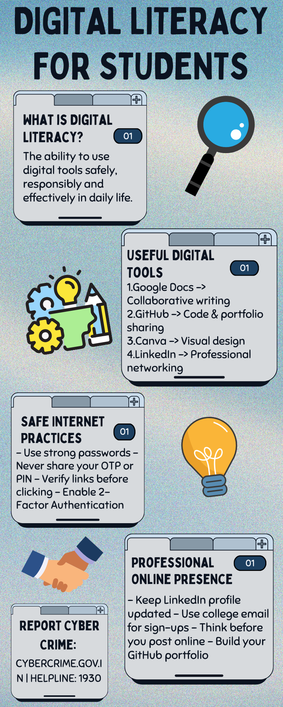

# 📘 Digital Literacy Portfolio — CSE0001

**Name:** Ankit Kumar Mandal
**Registration No.:** 25BAI10217
**Branch:** CSE | **Year:** First Year B.Tech
**University:** VIT Bhopal University
**Course:** CSE0001 – Digital Literacy

---

## 📂 Repository Structure

```
digital-literacy-project/
│
├── README.md
├── report/
│   └── Project_Report.docx
│
├── task-1-presentation/
│   └── digital-literacy-infographic.png
│
├── task-2-portfolio/
│   └── (screenshots of GitHub, LinkedIn, Kaggle profiles)
│
├── task-3-platforms/
│   └── (HackerRank challenge screenshot, Google Form screenshot)
│
├── task-4-email-etiquette/
│   ├── email-drafts.pdf
│   └── social-media-checklist.md
│
└── task-5-cybercrime/
    ├── casestudy.md
    └── prevention-checklist.md
```

---

## 📝 Module Summaries

### Task 1 – Digital Literacy Infographic
Created a one-page infographic using **Canva** covering: what digital literacy is, useful digital tools, safe internet practices, professional online presence, and cybercrime reporting.



---

### Task 2 – Student Digital Portfolio
Set up professional profiles on:
- 🐙 **GitHub** – [ankit-kr6](https://github.com/ankit-kr6)
- 💼 **LinkedIn** – *(add your LinkedIn profile URL here)*
- 📊 **Kaggle** – *(add your Kaggle profile URL here)*

---

### Task 3 – Coding & Collaboration Platforms
- Completed the **Solve Me First** beginner challenge on HackerRank
- Created a **Digital Literacy Awareness Quiz** using Google Forms (5 questions)
- 🔗 Google Form Link: *(paste your form link here)*

---

### Task 4 – Email Etiquette
- Drafted two professional emails: deadline extension request & internship interest
- Created a Social Media Do's and Don'ts checklist for college students

---

### Task 5 – Cybercrime Awareness
- Case study on **UPI / Online Payment Fraud**
- Prevention checklist with 8+ tips including UPI-specific safety practices
- 🚨 Report cybercrime at: [cybercrime.gov.in](https://www.cybercrime.gov.in) | Helpline: **1930**

---

## 🛠️ Tools Used

| Tool | Purpose |
|------|---------|
| Canva | Infographic design (Task 1) |
| GitHub | Repository hosting, portfolio (Task 2) |
| LinkedIn | Professional networking (Task 2) |
| Kaggle | Data science portfolio (Task 2) |
| HackerRank | Coding practice (Task 3) |
| Google Forms | Quiz creation (Task 3) |

---

*Submitted via VITyarthi portal as part of CSE0001 Digital Literacy project assessment.*
